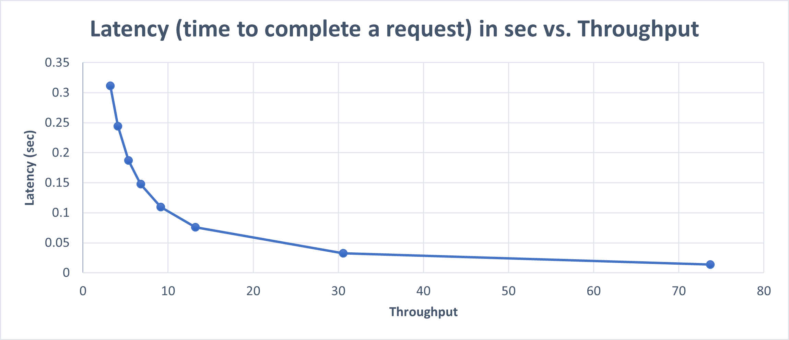

# Path-ORAM

This project is part of the course Advanced Topics in Online Privacy and Cyber Security at the Hebrew University.

It consists of client, server, utilils and Path_ORAM modules.

The client can store, retrieve and delete data from the server storage. With the use of the Path-ORAM encryption data structure the client can hide his access pattern from the third party storage provider.

The project uses the *Crypto.Cipher* python library.
You can install it with the command:
    
      pip install pycryptodome

## How to run?
To run the program you can open a terminal and run the following command:
    
      pytho3 Path_ORAM.py
The program will ask for a desired DB size and then display a menu of actions:
- store (1)
- retrieve (2)
- delete (3)
- Exit (9)

You will need to enter a number according to the desired action.
### Running example

### Running an analysis

